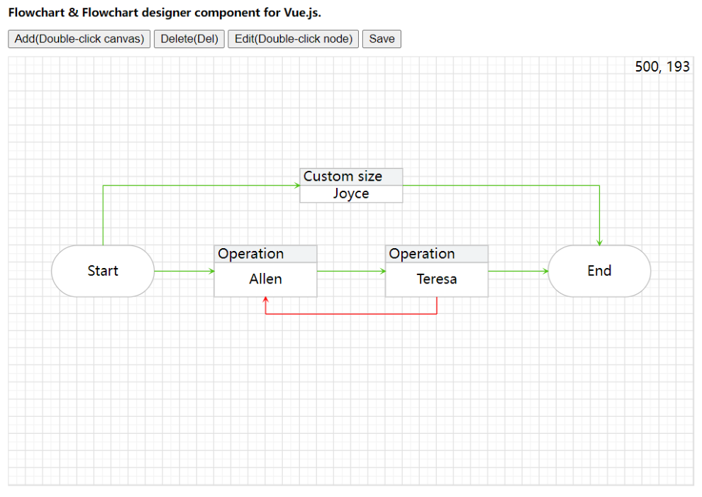

# Flowchart for Vue3



Fork from [Flowchart-vue](https://github.com/joyceworks/flowchart-vue), original README click [here](README.old.md).

## Changes

- [x] upgrade dependencies
  - [x] vue 2.5.x => vue 3.4.x
  - [x] upgrade d3-selection, d3-drag to latest
- [x] switch to vite
- [x] move demo app into /demo
- [x] lint, format with biome

## Usage

```sh
bun i 
bun run dev
```

## Demo

See [demo/App.vue](./demo/App.vue)

## License

[MIT](LICENSE)
